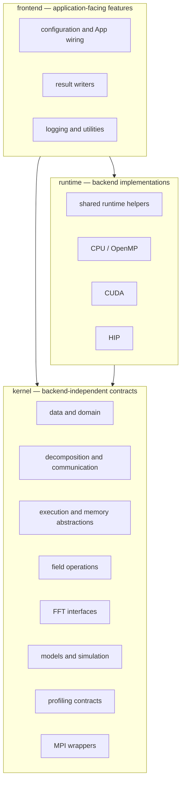
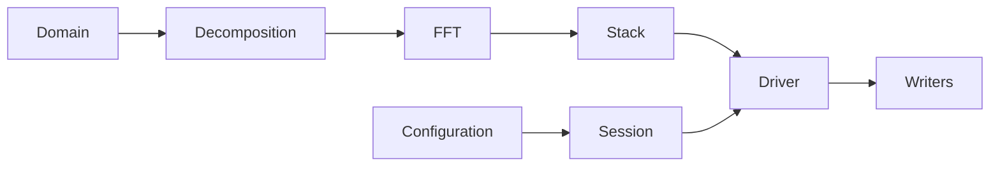

<!--
SPDX-FileCopyrightText: 2026 VTT Technical Research Centre of Finland Ltd
SPDX-License-Identifier: AGPL-3.0-or-later
-->

# Package architecture

OpenPFC is a framework for partial differential equations on structured
grids, with spectral and finite-difference discretizations. Phase-field
crystal models are the origin of the project and an important family of
applications. They are not the architectural boundary.

The code is organized into three logical layers: **kernel**, **runtime**,
and **frontend**. Those names describe dependency direction and extension
boundaries. They are not renamed to match the ownership rows below, and
this page does not add a C++ type for those rows. The layer names are more
stable than individual headers or helper types.

There is no `core` layer. Responsibilities that older versions grouped under
that name now live in focused kernel subdirectories.

Who owns a concept is [Semantic ownership](#semantic-ownership), not the
layer diagram.

## Dependency direction



Read the diagram as dependency direction. Ownership of a concept is the
[semantic ownership](#semantic-ownership) table, not a fourth box in the
figure. The layer names are unchanged.

The rules are:

1. **Kernel does not depend on runtime or frontend.** It defines data types,
   backend-independent interfaces, simulation contracts, and host-side
   execution primitives.
2. **Runtime depends on kernel.** It supplies CPU, CUDA, and HIP
   implementations behind kernel contracts.
3. **Frontend depends on kernel and runtime.** It adds configuration-driven
   application wiring, result writers, and user-facing utilities.

A lightweight program may use kernel and runtime directly without the frontend.
A full application normally uses all three layers.

## Semantic ownership

OpenPFC owns reusable mathematics, numerics, runtime infrastructure, shared
services, and reusable physics with independent semantics. Applications own
problem-specific composition and policy. Research studies own campaign
evidence and scientific interpretation.

Caller count is evidence of reuse, not the ownership rule. A concept may
belong in OpenPFC with one consumer when it already has an independent
mathematical or physical meaning. Several callers do not make an
application's policy into a framework concept.

| Concern | Owner | What belongs there |
|---------|-------|--------------------|
| Mathematical and numerical primitives | OpenPFC | `grad`, `div`, `curl`, Laplacians, projections, FFT, finite-difference, and Chebyshev operators, Poisson and Helmholtz solvers, and integration schemes |
| Reusable physics | OpenPFC, when the law has independent semantics | A physical law another problem can call without adopting the donor application's cases, materials, or interpretation |
| Runtime and backend realization | OpenPFC runtime | CPU, CUDA, and HIP realizations. They stay downstream of backend-independent contracts |
| Services and frontend | OpenPFC | Configuration, result writers, checkpoints, diagnostics, and profiling |
| Applications | The application | Problem-specific composition and policy: material presets, named benchmark and case setup, forcing policy, and case-specific interpretation |
| Research-study evidence | The research study | Campaign protocols, campaign outputs, and scientific interpretation. Not package verification |

The table is the stable target. Kernel, runtime, and frontend stay the
dependency layers in the diagram above. They are not renamed, and this
page does not add a C++ type for a row.

Fourier vector operators are kernel mathematics: `grad`, `div`, `curl`,
and the projections built from them. `solvers/` means reusable numerical
methods, including the finite-strain FFT Newton solver, microelasticity,
and the incompressible scheme. The rotational Navier–Stokes step is a
reusable solver. That directory is not a home for constitutive laws and
not a home for one application's policy. Reusable constitutive laws,
including STVK, J2, and crystal plasticity, belong in
`include/openpfc/mechanics/constitutive/`. The channel-wall projection
is application policy.

The host rotational step and its device twin are `pfc::incompressible`.
Fourier operators they call, including the Leray projection, curl, and
the 2/3 mask, stay `pfc::field` in `kernel/field/fourier_vector.hpp`.
Device buffers live under `runtime/gpu/` because they name device
memory. The namespace names the method.

`Tensor2`, its algebra, and `von_mises` live in
`include/openpfc/mechanics/tensor.hpp`. Transactional constitutive
history lives in `include/openpfc/mechanics/constitutive/history.hpp`.
The finite-strain FFT solver depends on those primitives and on its
`LocalConstitutiveLaw` port. A concrete law does not include the Newton
solver.

The current directory roles are kernel, `solvers/`, runtime, frontend,
and `apps/`. Kernel holds backend-independent contracts. `solvers/`
holds reusable numerical methods. Runtime holds CPU, CUDA, and HIP
realizations, downstream of those contracts. Frontend holds shared
services. Each application directory holds that application's
composition and policy. Research studies are not a source tree in this
package. A checkout can lag this description.

A reusable physical law may live in OpenPFC when its meaning does not
depend on one case list. Material presets, named benchmarks, forcing
policy, and case-specific interpretation stay in the application unless
a separate reusable contract is justified. Research campaigns are not
package architecture. Software verification of supported behavior,
including regression fixtures and numerical oracles, stays with the
package. Scientific interpretation of a study does not.

## Layer responsibilities

### Kernel

The kernel owns the concepts that should remain meaningful regardless of the
selected compute backend.

| Area | Responsibility |
|------|----------------|
| `kernel/data` | `Domain`, boxes, fields, strong types, and basic data containers |
| `kernel/decomposition` | MPI partitioning, neighbor relationships, and halo-exchange contracts |
| `kernel/execution` | execution spaces, memory spaces, views, buffers, and copy abstractions |
| `kernel/field` | field operations, finite-difference primitives, and iteration helpers |
| `kernel/fft` | FFT interfaces, layouts, and wave-number helpers |
| `kernel/simulation` | `Time`, `SimulationDriver`, stacks, modifiers, writers, and solver contracts |
| `kernel/checkpoint` | backend-independent persistent-state and checkpoint contracts |
| `kernel/profiling` | metric catalogs, scopes, sessions, and export contracts |
| `kernel/mpi` | small MPI environment and communicator helpers |

Kernel headers must not include runtime or frontend headers. Frontend
includes can be checked with:

```bash
rg 'openpfc/frontend' include/openpfc/kernel src/openpfc/kernel
```

Real includes in that search indicate a dependency-direction violation.

### Runtime

Runtime code realizes backend-specific behavior.

| Area | Responsibility |
|------|----------------|
| `runtime/common` | shared adapters, MPI timing, affinity handling, and common launch helpers |
| `runtime/cpu` | CPU and OpenMP execution plus the CPU FFT implementation |
| `runtime/gpu` | single-source CUDA/HIP memory, kernels, exchange, and device drivers |
| `runtime/cuda` | thin includes / namespace re-exports of `runtime/gpu` (`fft_cuda.hpp` is a thin include of `runtime/gpu/fft_gpu.hpp`) |
| `runtime/hip` | thin includes / namespace re-exports of `runtime/gpu` (`fft_hip.hpp` is a thin include of `runtime/gpu/fft_gpu.hpp`) |

Native `cudaMemcpy` / `hipMemcpy` in `include/` and `src/` must live under
`runtime/gpu/` (`scripts/check_gpu_memcpy_single_source.sh`). Apps and tests
may still call the vendor memcpy APIs directly.

Backend selection is made through templates, execution/memory-space types, and
explicit runtime headers. CUDA and HIP implementation code should not leak into
backend-independent kernel interfaces.

### Frontend

Frontend code turns the lower layers into deployable applications.

| Area | Responsibility |
|------|----------------|
| `frontend/ui` | JSON/TOML loading, parameter validation, catalogs, and simulation sessions |
| `frontend/io` | concrete binary, VTK, PNG, and related result writers |
| `frontend/utils` | application-facing logging, diagnostics, and convenience utilities |

The end-to-end configuration path is documented in
[`app_pipeline.md`](../user_guide/app_pipeline.md). Result formats and writer
selection are documented in [`io_results.md`](../user_guide/io_results.md).

### Solvers

`solvers/` holds reusable numerical methods, not constitutive laws and
not one application's policy. A module here implements a method another
application can call without taking on the donor application's materials
or case files. The finite-strain FFT Newton solver, periodic
microelasticity, and the incompressible scheme are that kind of method.
The rotational Navier–Stokes step is one of those solvers. Its public
names, including the device step, are `pfc::incompressible`. Reusable
constitutive laws, including STVK, J2, and crystal plasticity, belong in
`include/openpfc/mechanics/constitutive/`. `Tensor2` and transactional
history are mechanics primitives in `include/openpfc/mechanics/tensor.hpp`
and `include/openpfc/mechanics/constitutive/history.hpp`. The solver
includes them. A concrete law does not include the Newton loop.

The finite-strain solver takes a local `F -> P` law and a prescribed
macroscopic deformation gradient. One increment can continue from an
accepted field. Plastic history, when a law has any, stays inside that
law and is committed only when the caller accepts the increment. A
solver may use kernel and runtime facilities. It is not a place for one
application's calibration or acceptance thresholds.

### Applications

`apps/<name>` is one scientific application. It owns problem-specific
composition and policy, including material data and cases, and its `main`.
It links OpenPFC and its own headers. It does not include
another application's tree, and there is no shared `apps/common` target.
`scripts/check_app_self_containment.sh` fails the build when that boundary
is crossed.

An out-of-tree application is the same shape as an in-tree one:

```cmake
find_package(OpenPFC CONFIG REQUIRED)
target_link_libraries(my_app PRIVATE OpenPFC::openpfc)
```

That link propagates HeFFTe when the installed library was built with it.
Public spectral headers still include HeFFTe. The downstream target does not
name HeFFTe itself. `OpenPFCConfig` finds the dependency before the exported
targets.

## Primary workflows

### Spectral workflow

The spectral stack is the primary end-to-end path:



HeFFTe performs distributed FFT work. Real-space fields are transformed to
wave-number space, updated by the model or time integrator, transformed back,
and passed to modifiers and writers as configured.

Read [`spectral_stack.md`](spectral_stack.md) for the data-flow narrative and
[`../reference/class_tour.md`](../reference/class_tour.md) for the stable type
map.

### Finite-difference workflow

Finite-difference applications use the same domain decomposition and MPI
infrastructure but choose an explicit halo layout:

- **In-place halos** reuse boundary slabs inside the main array.
- **Separated halos** keep ghost faces outside the FFT-compatible core array.
- **Padded bricks** store owned cells and a surrounding ghost ring in one
  contiguous allocation.

The correct layout depends on whether the same field must also remain a valid
FFT input. Do not pass an array containing in-place ghost values to HeFFTe
unless the application has explicitly restored a pure subdomain layout.

See [`halo_exchange.md`](halo_exchange.md) for policies, overlap, persistent
communication, and runnable examples.

## Ownership and extension boundaries

[Semantic ownership](#semantic-ownership) decides the owner. This section
says which directory that owner uses, and which objects own `Time`
and fields. It does not rename layers.

OpenPFC favors data-centric types and free functions for queries and operations.
Inheritance is reserved for stable out-of-tree extension seams such as
`Model`, `FieldModifier`, and `ResultsWriter`.

`SimulationSession<Stack>` owns `Time` and a computational stack when
OpenPFC constructs that backend. `SimulationLifecycle` owns `Time`, named
fields, field modifiers, and generic hooks for a solver-independent step.
They are peer primitives: a frontend may use one, or compose a lifecycle
with a session's clock and fields. Neither replaces `SnapshotSeries` or
`DiagnosticsSeries`. See [Custom stepper lifecycle](custom_stepper.md).

Use these rules when adding functionality:

- put backend-independent contracts and algorithms in kernel;
- put CUDA/HIP/CPU realization details in runtime;
- put configuration, user interaction, and concrete application I/O in
  frontend;
- put a reusable numerical method, not a constitutive law and not one
  application's policy, in `solvers/`;
- put a reusable constitutive law, including STVK, J2, and crystal
  plasticity, in `include/openpfc/mechanics/constitutive/`;
- keep problem-specific composition and policy, including material
  presets, forcing, a channel-wall projection, and cases, in that
  application's directory;
- keep virtual interfaces narrow and delegate implementation to testable free
  functions;
- avoid introducing a generic catch-all directory such as `core`, `common`, or
  `utils` unless its sharing boundary is explicit.

The API-shape conventions and examples are in
[`../development/styleguide.md`](../development/styleguide.md).

## Public headers and includes

Headers under `include/openpfc/` form the public source-level API. Prefer the
specific header that declares the functionality you use:

```cpp
#include <openpfc/kernel/data/domain.hpp>
#include <openpfc/kernel/decomposition/decomposition.hpp>
#include <openpfc/kernel/fft/fft.hpp>
```

The convenience headers serve broader use cases:

- `<openpfc/openpfc.hpp>` includes the full public stack, including frontend
  facilities;
- `<openpfc/openpfc_minimal.hpp>` includes the kernel and minimal runtime pieces
  needed by small programmatic applications.

CUDA and HIP applications also include the relevant runtime headers and must be
built with the matching CMake option and dependency stack.

Installed consumers link the exported CMake target:

```cmake
target_link_libraries(my_sim PRIVATE OpenPFC::openpfc)
```

See [`../quickstart.md`](../quickstart.md) for the complete downstream CMake
shape.

## Architecture documentation policy

This page documents stable responsibilities and dependency rules. It should not
become an exhaustive list of every header, test, or experimental helper.

Use instead:

- the [integrated C++ API reference](../api/index.md) for signatures and member
  documentation;
- [`../reference/class_tour.md`](../reference/class_tour.md) for the primary
  concepts;
- [`../reference/examples_catalog.md`](../reference/examples_catalog.md) for
  runnable code;
- [`../MIGRATION_0.1_to_0.2.md`](../MIGRATION_0.1_to_0.2.md) for 0.1 → 0.2
  replacements;
- [`../adr/README.md`](../adr/README.md) for accepted architecture decisions;
- [`../archive/README.md`](../archive/README.md) for historical 0.2 planning
  documents.

## See also

- [`spectral_stack.md`](spectral_stack.md) — spectral data flow
- [`halo_exchange.md`](halo_exchange.md) — distributed halo layouts
- [`../user_guide/app_pipeline.md`](../user_guide/app_pipeline.md) — JSON/TOML
  to a 0.2 session
- [`../MIGRATION_0.1_to_0.2.md`](../MIGRATION_0.1_to_0.2.md) — 0.1 → 0.2 replacements
- [`../hpc/performance_profiling.md`](../hpc/performance_profiling.md) — runtime
  profiling
- [`../hpc/profiling_export_schema.md`](../hpc/profiling_export_schema.md) —
  profiling output contract
